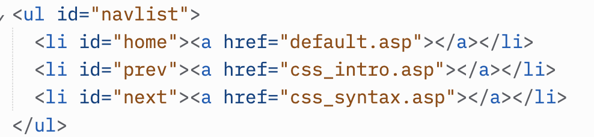
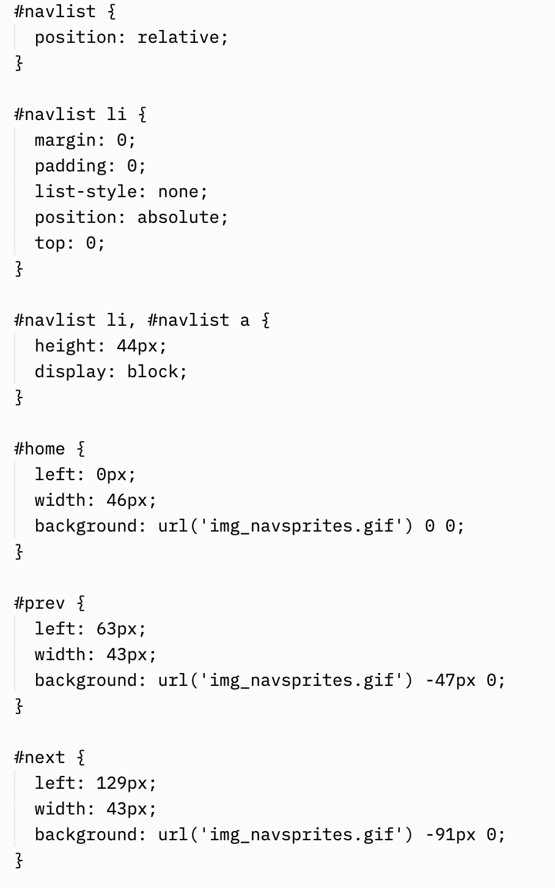

# Instructions  

  ** CSS Image Sprites and Forms **

  _ Responsive Form
Resize the browser window to see the effect. When the screen is less than 600px wide, make the two columns stack on top of each other instead of next to each other. _

  ## Steps
  1. Use this Repl.it to code your lab 14 before your move it to your portfolio
  2. Make sure you have a title and a separate CSS style sheet. also link to your main CSS using a absolute path link
  3. Create and add sprite icons on your page.

 

Here is theHTML for the form and Sprites
 
  